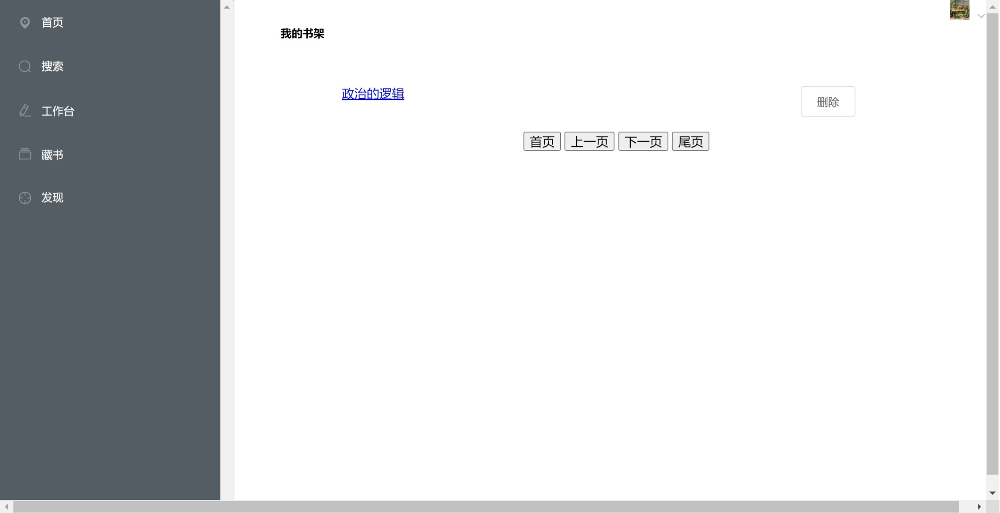
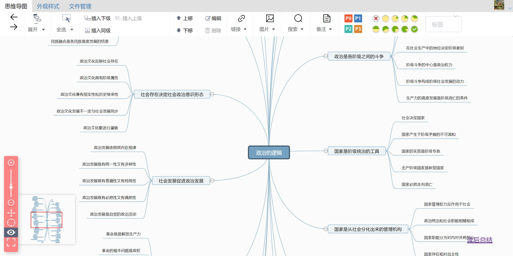
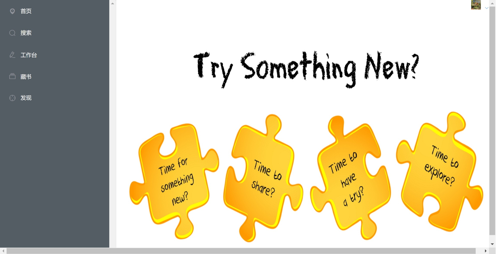
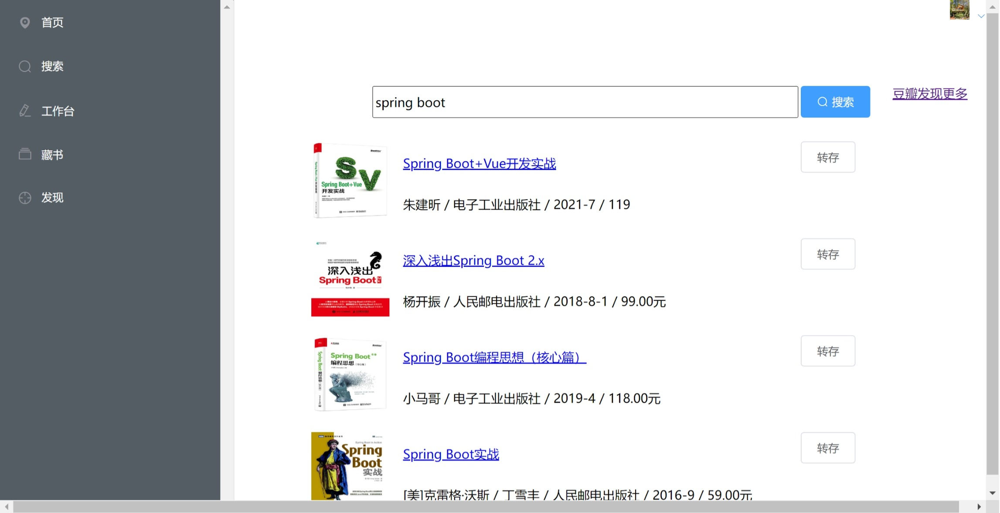

## 项目简介

MindMap是基于Spring boot + Vue 开发的个人书籍管理平台，通过将书籍目录脑图化并DIY后续内容，使其由文字形式转化为图片形式，可被更多感知细胞感知，从而达到加深理解记忆效果。包括搜索书籍，书籍转脑图，脑图存储，脑图编辑等功能。仅作学习使用

## 项目地址

- 后端项目 : [https://github.com/Erym5/mindMap](https://github.com/Erym5/mindMap)
- 前端项目 : [https://github.com/Erym5/mindMap-front-web](https://github.com/Erym5/mindMap-front-web)

## 本地安装后地址: http://localhost/swagger-ui/index.html#/

## 开发环境

- MongoDB 4.4
- Redis 3.0.504
- JDK 8
- Maven 3.3
- ElasticSearch 6.2.0
- RabbitMQ 3.8.12

## 后端技术选型

- spring boot
- MyBatis
- Lombok
- swagger3

## 前端技术选型

- Vue
- Vue Router
- axios
- element-ui
- Vuex

## 截图
bookshlef edit home search 

## 安装步骤

1. 下载源码

2. 数据库文件导入
    新建数据库map
    导入doc/naotu_struct.sql文件

3. 配置application.yml
    spring:
    datasource:
        url: jdbc:mysql://localhost:3306/map?useUnicode=true&characterEncoding=utf-8&useSSL=false&serverTimezone=Asia/Shanghai
        username: root
        password: root
        
4. 寻找图书搜索api接口。并在BookServiceImpl.java更改后运行
    **感谢**[https://github.com/acdzh/douban-book-api](https://github.com/acdzh/douban-book-api)提供的学习接口

5. mvn spring-boot:run